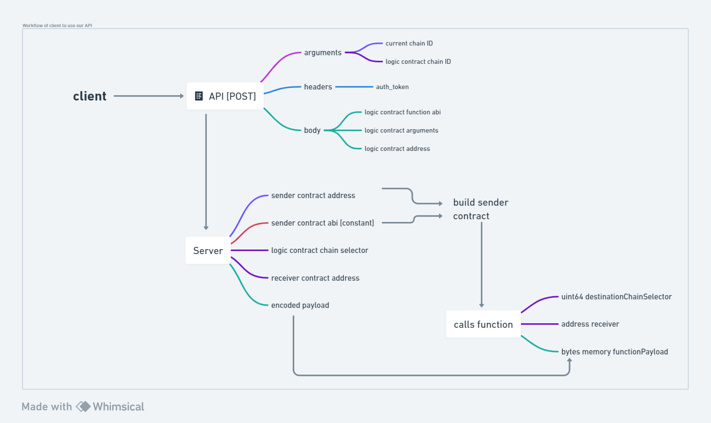

#	API Architecture
To understand the API architecture let us first get familiar with some of the terminologies that we will be using throughout. 

* Sender Contract – It is a CCIP enabled contract that is created and deployed by us on the chain from where user wants to send transaction. Such sender contracts have been deployed on all the possible CCIP enabled chains.

* Receiver Contract - It is a CCIP enabled contract that is created and deployed by us on the chain where logic contract is present i.e. the chain where user wants to send transaction to. Such receiver contracts have been deployed on all the possible CCIP enabled chains.

* Logic Contract – It is any custom contract that user wants to interact with. There are some restrictions and limitations that the logic contract must follow to avoid any security risks which will be discussed further later.

* Encoded payload – Encode payload is a `bytes` datatype that will be sent across chain and is used to call our logic smart contract function. There are 3 pieces of data that are encoded together to form our payload. These 3 pieces are essential to call the logic smart contract function. a) logic contract address b) JSON Interface c) function arguments

A logic contract address is of the form “0xEeD1BC651b805ADDc860bE962316D0b28d296f39”. The JSON interface is a JSON object describing the Application Binary Interface (ABI) for an Ethereum smart contract. An example for the same would be -

 

This JSON object represents a function named `myMethod` which takes two input parameters `myNumber` of type uint256 and myString of type string as arguments. The final piece is an array of string containing all the function arguments. For the above example the array would look something like this - ['2345675643', 'Hello!%'] 

The JSON interface and arguments are encoded together with the help of web3.eth.abi.encodeFunctionCall(JSONInterface, args) which takes two arguments, the first being JSON interface and the second being the array containing function arguments.
This returns a `bytes` datatype which is stored in a variable encodedFunctionCall and is again encoded with our logic contract address using web3.eth.abi.encodeParameters(['address', 'bytes'], [address, encodedFunctionCall]). Here, the first argument is an array containing the data types that will be encoded together. The second argument is again an array containing the values that we need to encode. This returns our final encoded payload which is sent via CCIP. We have used web3.js library to encode these 3 pieces of data. Refer to this documentation to learn more about web3.js and these encoding techniques.

### Now that we have covered these basic terminologies, let us refer to the flowchart below to understand the flow of control with an example. 
 
 

As discussed in our previous example, let us assume that the client wants to call the function `myMethod () ` which takes two arguments `myNumber` of type uint256 and `myString` of type string.
For simplicity, let us assume that the logic contract that defines the function `myMethod () ` is deployed on the “polygonMumbai” testnet chain and the client or the sender is on the “Ethereum sepolia” testnet. The client will send a POST request to our designated URL endpoint with “current chain ID” and “logic contract chain ID” as arguments. Here, current chain ID would be “11155111” for Ethereum sepolia and logic contract chain ID would be “80001” for polygonMumbai. The client will also need to send 3 parts as body object – 

* Logic contract function ABI - This is a JS object representing the function ABI. For example, 
 
* Logic contract arguments – This will represent an array of string containing values for all the function arguments. In our example, the array would be ['2345675643', 'Hello!%']
* Logic contract address – This would be the contract address of our deployed logic contract. Here is our logic contract deployed on polygonMumbai.

Our API server will process these data to send the following in JSON format – 
* Sender contract address – already deployed on current chain ID
* Sender contract ABI – ABI for the function `crossChainCall () ` that client will call on the sender contract.

The sender contract address and sender contract ABI sent to the client is used by the client to build the sender contract client side and call our function `crossChainCall () ` on the sender contract for a cross-chain call. This function takes 3 major arguments – (uint64 destinationChainSelector, address receiver, bytes memory functionPayload) 

* Logic contract chain selector – Each chain is assigned a unique integer chain selector by CCIP. We will send the chain selector associated with the logic contract chain ID. This will be the first parameter for the `crossChainCall () ` function call.
* Receiver contract address – receiver contract address deployed on logic contract chain ID. This is the second parameter for the function call.
* encoded payload – It is calculated using the body sent via POST request as explained here. It is the third parameter for the function call.
